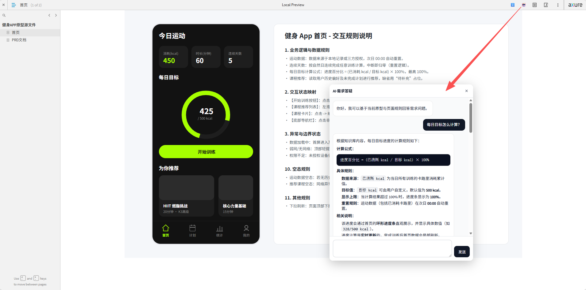

# 智能化可交互 PRD 与 AI 原型设计方案

## 1. 背景
传统 PRD 是单向文本传递，业务方阅读成本高、易产生理解偏差，原型交付后仍需大量时间澄清需求。本方案将 PRD 升级为**可交互形式**，深度融合 AI 对话能力，让业务方能与文档直接对话，高效获取和澄清需求。

---

## 2. 目标受众
**主要面向产品经理（PM）**，利用 AI 工具链（Dify、Trae/Cursor 等）和标准化文档格式，提升需求编写、原型设计及跨部门沟通效率。

---

## 3. 标准工作流

### 阶段一：需求采集与 PRD 生成
使用 `prd-generation` 技能，通过多轮对话引导式采集需求，自动产出：
- `YYMMDD项目名称-核心PRD.md` — 面向业务方、管理层
- `YYMMDD项目名称-详细PRD.md` — 面向研发团队
- `index.html` — 可交互 HTML 版本

### 阶段二：可交互文档评审
1. **嵌入 AI 助手（可选）**：在 HTML 中嵌入 Dify 对话插件，将 PRD 内容作为知识库
2. **评审与答疑**：阅读者可直接向 AI 提问（如"未登录状态下点击购买会发生什么？"），AI 结合上下文解答

### 阶段三：智能原型绘制与交付
1. **SVG 原型生成**：使用 `axure-prototype-svg` 技能根据 PRD 绘制 SVG 格式原型
2. **原型精调**：在设计工具中修改细节后定稿
3. **最终交付**：定稿原型 + 可交互 PRD 文档
4. **原型托管（可选）**：结合 Vibe Coding 原型托管项目，实现与原型对话能力

**原型托管平台**：https://axure.izam.cn（账号：test_user / 密码：123456）

---

## 4. 最佳实践
- **文档模块化**：保持功能模块清晰划分，让 AI 知识库问答更精准，减少"幻觉"
- **持续优化 Prompt**：定期收集常见问题，优化系统提示词、SKILL.md 和 QA 示例

---
