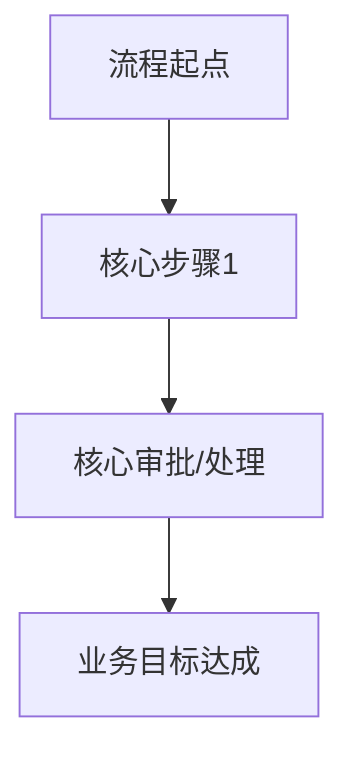

# 【项目/产品名称】核心需求说明 (PRD)

> **文档定位**：本文档旨在向业务方、管理层及研发团队快速同步核心业务目标、范围与主流程，摒弃繁杂的页面细节，以便相关人员能快速聚焦核心价值。
> *详细的页面交互说明，请直接参考关联的原型或设计稿。*

## 1. 🎯 业务背景与目标
*【说明为什么要做，以及期望达成的可量化业务价值】*
- **业务背景**：【一句话说明当前痛点或机会，如：现有订单处理流程繁琐，耗时过长】
- **核心目标**：【要达成的可量化指标，如：提升处理效率50%、缩短时长至2小时】

## 2. 👤 目标用户与核心场景
*【明确产品主要服务对象及其最关心的核心诉求】*
- **目标用户**：【谁在使用本产品/功能，如：一线客服人员】
- **核心场景**：【在什么情况下，用户想要解决什么问题，如：面对用户投诉时，能一键发起退款】

## 3. 📋 产品范围与功能清单
*【明确本次迭代的核心边界，确保业务方对交付范围预期一致】*

### 3.1 核心功能清单
| 模块 | 功能名称 | 业务价值/解决的问题 | 优先级 |
|------|---------|------------------|-------|
| 【模块A】 | 【功能1】 | 【如：解决手动录入数据的效率问题】 | P0 |
| 【模块A】 | 【功能2】 | 【如：提供数据统计支持】 | P1 |

### 3.2 明确不做的范围 (Out of Scope)
*【明确列出本次不包含的功能，避免需求蔓延和期望不一致】*
- 【如：本次暂不涉及退款失败的自动重试机制】
- 【如：不包含复杂的数据大屏展示】

## 4. 🔄 核心业务主流程
*【仅展示主干业务流程或核心状态机，不陷入细枝末节的异常分支】*

## 5. 🧩 核心页面与功能说明
*【按模块划分，重点说明各页面的核心业务功能、价值及关键交互规则。纯UI细节请参考原型】*

### 5.1 【模块一：XXX模块】

#### 5.1.1 【页面：XXX页面】
- **页面描述**：*【一句话说明页面的定位和核心目标】*
- **页面结构**：【简述页面核心组成，如：顶部统计数据区 + 底部明细列表区】

**核心功能说明：**

* **功能 1：【功能名称，如：销售数据汇总】**
  - **需求描述**：【分条列举用户在此功能里能做什么/看到什么，如：能查看当前月的销售数据汇总、能查看最近7天的销售趋势】
  - **业务价值**：【分条列举该功能解决的问题或带来的业务收益，如：提升数据决策效率、帮助业务发现问题及时调整策略】
  - **功能要求**：【分条列举核心的业务规则、计算逻辑或数据要求，如：数据需实时更新、支持自定义时间范围】

* **功能 2：【功能名称，如：异常订单高亮】**
  - **需求描述**：【...】
  - **业务价值**：【...】
  - **功能要求**：【...】

**流程与交互要点：**
*【仅描述影响业务流转的核心交互，无需罗列基础的非空校验等细节】*
- 【要点1，如：点击“审批通过”后，需弹窗二次确认并要求填写审批意见（非必填）】
- 【要点2，如：列表数据超过1万条时限制批量导出功能】

### 5.2 【模块二：XXX模块】
*(按上述结构复制)*

## 6. ❓ FAQ (常见问题)
*【针对业务方可能关心的核心业务规则或场景疑问进行提前解答】*

| 业务疑问 | 规则解答 |
|---------|---------|
| 【如：遇到订单异常退款，财务那边怎么对账？】 | 【回答具体的对账逻辑或系统处理方式】 |
| 【如：如果用户修改了绑定的手机号，历史数据还在吗？】 | 【回答数据归属逻辑】 |

## 7. 🚀 后续规划 (Roadmap)
*【简述该业务模块或产品方向在未来的迭代计划，帮助业务方建立长期演进的预期】*

- **短期规划（1-3个月）**：【如：先实现基础的线上审批流，替代线下纸质审批】
- **中期规划（3-6个月）**：【如：引入自动化审批规则，针对低风险单据实现秒批】
- **长期愿景**：【如：打造全链路智能风控平台】

## 8. 📎 附录
*【存放帮助理解核心业务逻辑的辅助资料】*

- **业务术语解释**：
  - 【术语A】：【解释该专业名词在当前业务上下文中的具体含义，如：SLA（服务等级协议）】
- **相关参考链接**：
  - 【如：竞品分析报告】[链接]
  - 【如：前期业务需求调研文档】[链接]

---
*文档版本：v1.0*
*最后更新：YYYY-MM-DD*
*相关链接：[会议纪要/设计稿等链接]*