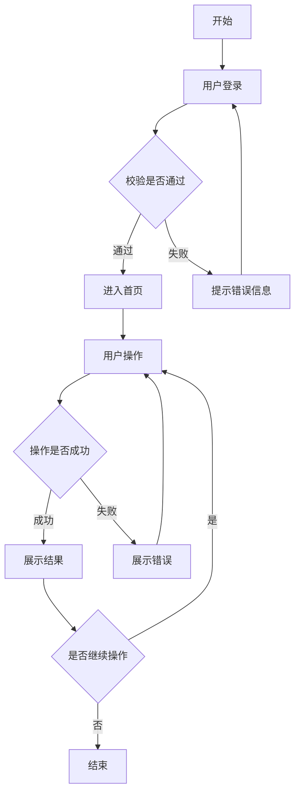

# PRD 产品需求文档模板

> **使用说明**：本文档为PRD（Product Requirements Document）通用模板，适用于各类互联网产品（B端/C端、移动端/PC端）。文档中以`【】`标注的内容为必填项，以`（选填）`标注的内容可根据项目类型选择性填写。灰色斜体内容为填写指导，实际使用时请删除。

---

## 1. 📄 文档概述

| 字段 | 内容 |
|-----|------|
| 文档名称 | 【产品/项目名称】需求文档 |
| 模块/范围 | 【本次需求涉及的产品模块或功能范围】 |
| 作者 | 【产品经理姓名】 |
| 创建时间 | 【YYYY-MM-DD】 |
| 当前版本 | 【如 v1.0】 |
| 相关文档 | 【相关设计稿、接口文档、用户手册等，用换行分隔】 |

### 1.1 修订历史

| 版本 | 日期 | 作者 | 变更说明 |
|-----|------|-----|---------|
| v1.0 | 【日期】 | 【作者】 | 【初始版本】 |
| v1.1 | 【日期】 | 【作者】 | 【变更内容】 |

### 1.2 文档说明

*本文档面向产品、设计、研发、测试，描述需求、页面结构、交互流程、业务规则与边界条件。阅读者应具备基础的业务背景知识。*

---

## 2. 🎯 产品目标与背景

### 2.1 产品定位与目标用户

*【定义产品的基本属性和主要服务对象】*
- **产品定位**：【一句话说明产品是什么，为谁提供什么核心价值】
- **目标用户**：【核心用户群体画像、年龄段、特征等】
- **核心场景**：【用户在什么情况下会使用本产品】

**示例：**
> **产品定位**：一款面向健身爱好者的移动端应用首页，旨在为用户提供直观的运动数据展示和课程推荐功能。
> **目标用户**：18-45 岁的健身爱好者，关注个人健康和体型管理。
> **核心场景**：日常健身打卡、查看运动数据、选择训练课程。

### 2.2 背景说明

*【说明为什么要做这个产品/功能，从以下角度阐述】：*
- *市场环境：行业趋势、竞争对手动态、政策法规变化*
- *用户痛点：用户遇到了什么问题，现有方案有什么不足*
- *业务现状：当前业务流程是什么，存在什么效率问题或业务瓶颈*

**示例：**
> 随着在线教育用户规模增长，用户反馈课程退款流程繁琐，平均退款时长超过72小时，影响用户满意度。竞品分析显示，头部产品已将退款时长压缩至4小时内。为提升用户留存和口碑，需优化退款流程。

### 2.3 产品目标

*【用可量化的指标描述本次需求要达成的目标（可留空，切勿编造）】：*
- *目标应遵循SMART原则：具体(Specific)、可衡量(Measurable)、可达成(Achievable)、相关性(Relevant)、时限性(Time-bound)*

| 目标维度 | 当前状态 | 目标状态 | 提升幅度 |
|---------|---------|---------|---------|
| 【指标1，如退款时长】 | 【当前值】 | 【目标值】 | 【提升X%】 |
| 【指标2，如转化率】 | 【当前值】 | 【目标值】 | 【提升X%】 |

**示例：**
> - 退款处理时长：从 72小时 缩短至 **4小时**
> - 退款流程转化率：从 60% 提升至 **85%**
> - 用户满意度（退款相关）：从 3.2 提升至 **4.5**

### 2.4 成功标准

*【界定需求上线的"成功"标准，作为后续复盘依据】：**

- [ ] 【指标1】达到目标值
- [ ] 【指标2】达到目标值
- [ ] 【无重大客诉/故障】

---

## 3. 👤 用户与使用场景

### 3.1 用户角色

*【梳理使用本产品/功能的所有用户角色，明确每种角色的定义和系统操作范围】*

**系统内角色（有系统账号，参与系统操作）：**

| 角色 | 定义/描述 | 典型系统能力范围 |
|-----|---------|--------------|
| 【角色1，如普通用户】 | 【说明什么条件下成为该角色，如：完成注册的用户】 | 【该角色在系统中的主要功能权限】 |
| 【角色2，如管理员】 | 【说明该角色的职责范围】 | 【该角色的功能权限】 |
| 【角色3，如客服】 | 【内部客服或外部客服】 | 【工单处理、用户管理等】 |

**外部组织与流程参与方（通常不直接操作系统，或仅以"观察者账号"参与）：**

| 组织/角色 | 在系统中的体现 | 备注 |
|---------|------------|-----|
| 【如供应商】 | 【作为某流程的发起方或接收方】 | 【说明参与方式】 |
| 【如监管机构】 | 【数据报送/报告查看】 | 【说明报送内容】 |

### 3.2 使用场景

*【使用"用户-场景-目标"格式描述核心使用场景，突出"在什么情况下，谁，做什么，达成什么结果"】*

**场景1：【场景名称】**

| 要素 | 内容 |
|-----|-----|
| 用户 | 【目标用户】 |
| 场景 | 【在什么环境/条件下触发，如：工作日上午，在PC端】 |
| 触发 | 【用户如何开始这个流程】 |
| 目标 | 【用户想达成什么】 |
| 关键行为 | 【主要操作步骤】 |
| 期望结果 | 【用户期望的系统反馈】 |

**场景2：（按需添加）**

---

## 4. 📋 功能清单（核心）

*【列出本次需求包含的所有功能点，按模块/优先级组织】*

### 4.1 功能总览

| 编号 | 功能名称 | 所属模块 | 描述 | 优先级 | 备注 |
|-----|---------|---------|-----|-------|-----|
| F001 | 【功能名称】 | 【模块名】 | 【一句话描述功能】 | P0 | 【必做/核心】 |
| F002 | 【功能名称】 | 【模块名】 | 【一句话描述功能】 | P1 | 【重要】 |
| F003 | 【功能名称】 | 【模块名】 | 【一句话描述功能】 | P2 | 【优化/增强】 |

*优先级说明：P0=核心功能（必做）、P1=重要功能（应做）、P2=辅助功能（可选）*

### 4.2 模块说明（可复用能力）

*【说明本次需求涉及的核心模块划分，定义模块职责和对外接口】*

| 模块 | 类型 | 核心职责 | 对外接口/依赖 |
|-----|-----|---------|-------------|
| 【模块1】 | 业务模块/公共模块 | 【模块做什么】 | 【依赖哪些系统/模块】 |
| 【模块2】 | 业务模块/公共模块 | 【模块做什么】 | 【被哪些模块调用】 |

*模块划分原则：高内聚、低耦合，模块可独立开发、测试、部署*

### 4.3 业务规则（全局）

*【说明贯穿多个页面或模块的通用业务计算逻辑、数据流转规则等】*

**规则 1：【规则名称，如：数据统计规则】**
- 【逻辑1，如：卡路里消耗：累计当日所有训练的卡路里消耗】
- 【逻辑2，如：连续天数：从最近一次运动日开始，连续运动的天数（中断则重置为 0）】

**规则 2：【规则名称，如：目标进度计算】**
- 【逻辑1，如：进度百分比 = (已完成卡路里 / 目标卡路里) × 100%】
- 【逻辑2，如：进度超过 100% 时，显示为 100%】

---

## 5. 🔄 功能流程图

### 5.1 业务流程图

*【用Mermaid语法绘制主业务流程图，覆盖核心链路】*



### 5.2 页面流程图

*【展示页面之间的跳转关系】*


---

## 6. 🧩 页面说明与交互细节（按模块拆分）

### 6.1 全局交互规范

#### 6.1.1 布局框架

- **结构**：采用【如：顶部导航+左侧菜单+主内容区】布局
- **顶部栏**：包含【如：Logo、搜索、消息通知、用户头像】等功能
- **内容区**：采用【如：左右布局、自适应宽度】方式

#### 6.1.2 状态定义

| 状态 | 视觉表现 | 含义 | 触发条件 |
|-----|---------|-----|---------|
| 【状态1，如：待处理】 | 【颜色+图标，如：蓝色圆点】 | 【状态说明】 | 【如何进入此状态】 |
| 【状态2，如：已完成】 | 【颜色+图标，如：绿色对勾】 | 【状态说明】 | 【如何进入此状态】 |
| 【状态3，如：已取消】 | 【颜色+图标，如：灰色横线】 | 【状态说明】 | 【如何进入此状态】 |

#### 6.1.3 通用交互规则

| 规则类型 | 说明 |
|---------|-----|
| 加载状态 | 【如：骨架屏/loading图标，超过3秒显示进度】 |
| 空状态 | 【如：显示空态插图+引导文案】 |
| 错误状态 | 【如：红色提示条+错误描述+重试按钮】 |
| 权限控制 | 【如：无权限时显示"暂无权限"而非隐藏入口】 |
| 跳转规则 | 【如：表单提交后跳转至列表页，并弹出成功提示】 |

---

### 6.2 【模块一：XXX】

#### 6.2.1 【页面：XXX页面】

**页面描述**：*【说明页面的定位和核心功能，一句话概括】*

**入口**：【如：左侧菜单「XXX」点击进入 / URL: /xxx/xxx】

**页面结构**：

```
+----------------------------------+
|  页面标题              [操作按钮]  |
+----------------------------------+
|  筛选区                          |
|  [筛选条件1] [筛选条件2] [搜索]    |
+----------------------------------+
|  数据列表/卡片区                  |
|  +------+  +------+  +------+    |
|  | 卡片1 |  | 卡片2 |  | 卡片3 |    |
|  +------+  +------+  +------+    |
+----------------------------------+
|  分页器/加载更多                  |
+----------------------------------+
```

**功能说明**：

*【详细描述页面内的核心功能点，每个功能点应包含需求描述、业务价值和功能要求】*

#### 功能 1：【功能名称，如：运动数据统计】
- **需求描述**：
  - 【描述用户在这个功能里能做什么、看到什么。如：用户打开首页后，能够一目了然地看到今日的运动数据统计】
- **业务价值**：
  - 【价值点1，如：让用户快速了解今日运动成果】
  - 【价值点2，如：通过数据可视化增强用户成就感】
- **功能要求**：
  - 【要求1，如：显示三个核心指标：卡路里消耗、运动分钟数、连续运动天数】
  - 【要求2，如：数据实时更新，反映最新运动状态】

#### 功能 2：【功能名称】
- **需求描述**：【...】
- **业务价值**：【...】
- **功能要求**：【...】

**流程与交互**：

- **Step 1 【操作名称】**
  - 用户点击【按钮/区域】
  - 系统执行【动作】
  - 页面【变化】

- **Step 2 【校验/分支】**
  - 校验条件：【如：字段A必填、字段B格式校验】
  - 校验通过：进入下一步
  - 校验失败：显示错误提示【如："XXX不能为空"，高亮对应输入框】

**字段说明**：

| 字段名称 | 类型 | 必填 | 校验规则 | 默认值 | 备注 |
|---------|-----|-----|---------|-------|-----|
| 【字段A】 | 文本 | 是 | 【如：最多50字符】 | - | 【说明】 |
| 【字段B】 | 数字 | 否 | 【如：范围1-100】 | 0 | 【说明】 |
| 【字段C】 | 日期 | 是 | 【如：不能早于今天】 | 当天 | 【说明】 |

**边界条件**：

- 【如：数据量为0时显示空态插图】
- 【如：超过100条数据时分页展示】
- 【如：网络异常时显示重试按钮】

#### 6.2.2 【页面：XXX弹窗/抽屉】

*【弹窗类页面说明，如：新建弹窗、详情抽屉、确认对话框】*

**弹窗描述**：【说明弹窗的用途】

**页面结构**：

```
+--------------------------------+
|  标题            [关闭按钮]      |
+--------------------------------+
|  表单区域                       |
|  [字段1] [字段2]                |
|  [字段3] [字段4]                |
+--------------------------------+
|  操作区                         |
|         [取消]  [确认]           |
+--------------------------------+
```

**交互细节**：

| 场景 | 交互 |
|-----|-----|
| 点击取消 | 【如：关闭弹窗，不保存数据】 |
| 点击确认 | 【如：校验通过后提交，关闭弹窗，刷新列表】 |
| 点击关闭/蒙层 | 【如：弹出确认框"是否放弃未保存的数据？"】 |
| 键盘操作 | 【如：ESC关闭弹窗，Enter提交】 |

---

### 6.3 【模块二：XXX】

*【按模块组织页面说明，结构与6.2一致】*

---

## 7. 📊 数据需求

### 7.1 数据统计口径

*【定义关键指标的统计逻辑，避免歧义】*

| 指标名称 | 定义 | 计算公式 | 数据来源 |
|---------|-----|---------|---------|
| 【如：日活跃用户】 | 【明确定义什么算"活跃"】 | 【如：DAU = 当天有任意行为的去重用户数】 | 【如：user_behavior表】 |
| 【如：转化率】 | 【明确分子分母】 | 【如：转化率 = 支付成功UV / 提交订单UV × 100%】 | 【如：order表】 |

### 7.2 数据权限

| 角色 | 可查看数据范围 | 备注 |
|-----|-------------|-----|
| 【角色1】 | 【如：仅可见自己创建的数据】 | - |
| 【角色2】 | 【如：可见本部门所有数据】 | - |

---

## 8. 🔌 接口需求（选填）

*【如有外部系统交互或系统间调用需求，在此说明】*

### 8.1 外部接口（选填）

*【说明与第三方系统的交互需求，如支付、短信、地图等】*

- **【第三方系统名称】**：
  - 用途：【做什么】
  - 交互说明：【描述调用逻辑或数据交换方式】

### 8.2 内部接口（选填）

*【说明与内部其他系统的交互需求，如用户系统、订单系统等】*

- **【系统/服务名称】**：
  - 用途：【做什么】
  - 交互说明：【描述调用逻辑或数据交换方式】

### 8.3 数据格式约定（选填）

*【如有特殊数据格式要求，在此说明】*

- 【如：日期格式统一使用ISO 8601格式（YYYY-MM-DD）】
- 【如：金额单位统一使用分】

---

## 9. 🎨 非功能性需求

### 9.1 性能要求

| 指标 | 要求 | 备注 |
|-----|-----|-----|
| 页面加载时长 | 【如：首屏加载 < 2秒】 | 【含服务端处理时间】 |
| 接口响应时长 | 【如：P99 < 500ms】 | 【不含网络传输时间】 |
| 并发支持 | 【如：支持1000并发用户】 | - |
| 大数据量 | 【如：列表超过1万条时需分页】 | - |

### 9.2 可用性要求

| 指标 | 要求 |
|-----|-----|
| 系统可用性 | 【如：99.9%】 |
| 容灾能力 | 【如：主服务故障时自动切换到备用服务】 |
| 数据备份 | 【如：每日全量备份，实时增量备份】 |

### 9.3 安全要求

| 要求项 | 说明 |
|-------|-----|
| 身份认证 | 【如：支持SSO/OAuth2.0】 |
| 权限控制 | 【如：按钮级权限控制】 |
| 数据安全 | 【如：敏感数据加密存储，传输使用HTTPS】 |
| 审计日志 | 【如：关键操作记录审计日志】 |

### 9.4 兼容性要求

| 类型 | 要求 |
|-----|-----|
| 浏览器 | 【如：Chrome 80+、Firefox 75+、Safari 13+、Edge 80+】 |
| 移动端 | 【如：iOS 12+、Android 8+】 |
| 屏幕分辨率 | 【如：最小支持 1280×720】 |

---

## 10. 📦 依赖与风险

### 10.1 外部依赖

| 依赖方 | 依赖内容 | 交付时间 | 备注 |
|-------|---------|---------|-----|
| 【如：第三方支付】 | 【如：支付接口文档】 | 【日期】 | 【如：接口延迟将影响上线】 |
| 【如：运营团队】 | 【如：商品数据】 | 【日期】 | 【需提前准备】 |

### 10.2 内部依赖

| 依赖方 | 依赖内容 | 交付时间 | 备注 |
|-------|---------|---------|-----|
| 【如：设计组】 | 【如：高保真设计稿】 | 【日期】 | - |
| 【如：测试组】 | 【如：测试环境】 | 【日期】 | - |

### 10.3 风险识别

| 风险 | 概率 | 影响 | 应对措施 |
|-----|-----|-----|---------|
| 【如：接口延期】 | 中 | 高 | 【预案：使用Mock数据】 |
| 【如：数据准备延迟】 | 低 | 中 | 【提前跟进运营】 |

---

## 11. ❓ FAQ（选填）

*【收集常见问题，提前明确业务规则】*

| 问题 | 答案 |
|-----|-----|
| 【如：用户取消订单后多久能退款？】 | 【T+1工作日内原路返回】 |
| 【如：是否能合并支付？】 | 【不支持，每个订单单独支付】 |

---

## 12. ✅ 验收标准

### 12.1 功能验收

| 功能点 | 验收条件 | 验证方式 |
|-------|---------|---------|
| 【功能1】 | 【满足什么条件算验收通过】 | 【如：手动测试】 |
| 【功能2】 | 【满足什么条件算验收通过】 | 【如：自动化测试】 |

### 12.2 验收 Checklist

- [ ] 【功能1】符合需求描述
- [ ] 【功能2】符合需求描述
- [ ] 页面交互符合设计稿
- [ ] 边界条件处理正确
- [ ] 性能指标达标
- [ ] 无安全性问题
- [ ] 文档齐全（用户手册/操作指南）

---

## 13. 🚀 后续规划（选填）

*【说明该产品/功能的未来演进方向，帮助团队了解长期愿景，避免架构设计过度短视】*

### 13.1 短期规划（1-3 个月）
- 【规划项1，如：增加运动数据趋势图表】
- 【规划项2，如：支持自定义目标类型（步数、运动时长等）】

### 13.2 中期规划（3-6 个月）
- 【规划项1，如：增加社交功能（好友排行榜、运动打卡分享）】
- 【规划项2，如：支持训练计划管理】

### 13.3 长期规划（6-12 个月）
- 【规划项1，如：接入智能穿戴设备数据】
- 【规划项2，如：提供 AI 私教功能】

---

## 14. 📎 附录（选填）

### 14.1 术语表

| 术语 | 定义 |
|-----|-----|
| 【术语1】 | 【定义】 |
| 【术语2】 | 【定义】 |

### 14.2 参考文档

| 文档名称 | 链接/位置 |
|---------|---------|
| 【如：产品Roadmap】 | 【链接】 |
| 【如：竞品分析报告】 | 【链接】 |

---

*文档版本：v1.0*
*最后更新：YYYY-MM-DD*
