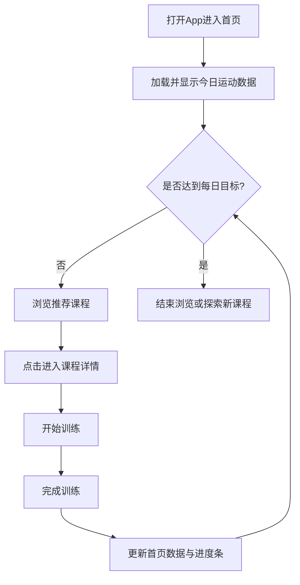

# 健身 App 首页核心需求说明 (PRD)

> **文档定位**：本文档旨在向业务方、管理层及研发团队快速同步核心业务目标、范围与主流程，摒弃繁杂的页面细节，以便相关人员能快速聚焦核心价值。
> *详细的页面交互说明，请直接参考关联的原型或设计稿。*

## 1. 🎯 业务背景与目标
- **业务背景**：为了更好地服务健身爱好者，提供一个直观的运动数据展示、目标管理和课程推荐的移动端首页，通过现代化的暗黑主题设计和流畅交互激励用户坚持运动。
- **核心目标**：
  - 提升用户运动积极性，增加日活跃度（DAU提升20%）。
  - 用户平均停留时长增加30%。
  - 每日目标完成率达到60%。
  - 课程点击率（CTR）达到15%，课程转化率提升10%。

## 2. 👤 目标用户与核心场景
- **目标用户**：18-45 岁的健身爱好者（关注健康、习惯移动端记录、喜欢可视化数据、需要专业指导）。
- **核心场景**：日常健身打卡、查看运动数据、选择并快速启动训练课程。

## 3. 📋 产品范围与功能清单

### 3.1 核心功能清单
| 模块 | 功能名称 | 业务价值/解决的问题 | 优先级 |
|------|---------|------------------|-------|
| 首页 | 运动数据统计 | 让用户快速了解今日运动成果，通过连续天数激励保持习惯 | P0 |
| 首页 | 每日目标管理 | 帮助设定目标，提供快速启动训练入口，进度可视化 | P0 |
| 首页 | 底部导航 | 提供清晰的信息架构和快速模块切换 | P0 |
| 首页 | 课程推荐 | 提高课程曝光和转化，帮助用户发现适合的内容 | P1 |

### 3.2 明确不做的范围 (Out of Scope)
- 本版本仅支持移动端，不支持桌面端。
- 暂不支持复杂的社交功能（如好友排行榜、运动打卡分享）。
- 暂不支持智能穿戴设备的直接数据接入。

## 4. 🔄 核心业务主流程

## 5. 🧩 核心页面与功能说明

### 5.1 【首页模块】

#### 5.1.1 【页面：健身App首页】
- **页面描述**：健身爱好者进入应用的首个页面，展示核心数据、目标进度并推荐个性化课程。
- **页面结构**：顶部运动数据卡片区 + 中部环形目标进度区 + 底部横向课程推荐列表 + 固定底部导航栏。

**核心功能说明：**

* **功能 1：运动数据统计**
  - **需求描述**：直观展示今日卡路里消耗、运动分钟数、连续运动天数。
  - **业务价值**：可视化数据增强成就感。
  - **功能要求**：独立卡片展示，配有图标，数据实时更新。

* **功能 2：每日目标管理**
  - **需求描述**：展示每日卡路里消耗目标的环形进度条，包含具体数值。
  - **业务价值**：明确目标，提供“开始训练”快捷入口。
  - **功能要求**：支持自定义每日目标值，进度超过100%显示为100%。

* **功能 3：课程推荐**
  - **需求描述**：基于偏好和历史数据推荐未完成的相似课程。
  - **业务价值**：提高用户停留时间与课程转化率。
  - **功能要求**：横向滚动列表，展示封面、标题、时长、难度、分类标签。

**流程与交互要点：**
- 点击“开始训练”快速启动流程。
- 课程列表横向滑动浏览，支持动态加载。
- 底部导航项高亮显示当前选中状态，点击无缝切换。

## 6. ❓ FAQ (常见问题)

| 业务疑问 | 规则解答 |
|---------|---------|
| 连续运动天数如何计算？ | 从最近一次运动日开始，连续运动的天数。若中间有中断，则重置为0。 |
| 离线状态下首页能否正常使用？ | 课程数据依赖后端接口，离线状态下课程推荐功能受限，会展示友好的网络错误提示。 |

## 7. 🚀 后续规划 (Roadmap)

- **短期规划（1-3个月）**：增加运动数据趋势图表；支持自定义目标类型（如步数、运动时长）；优化推荐算法。
- **中期规划（3-6个月）**：增加社交功能（好友排行榜、运动打卡）；支持训练计划管理；增加激励机制。
- **长期愿景（6-12个月）**：接入智能穿戴设备数据；提供 AI 私教功能；支持多语言和国际化。

## 8. 📎 附录

- **业务术语解释**：
  - **kcal**：千卡，能量单位，用于衡量卡路里消耗。
  - **HIIT**：高强度间歇训练（High-Intensity Interval Training）。
  - **K1/K2/K3**：课程难度等级，K1 为入门，K3 为高级。
  - **DAU**：日活跃用户数（Daily Active Users）。
  - **CTR**：点击率（Click-Through Rate）。

---
*文档版本：v1.0*
*最后更新：2026-03-24*
