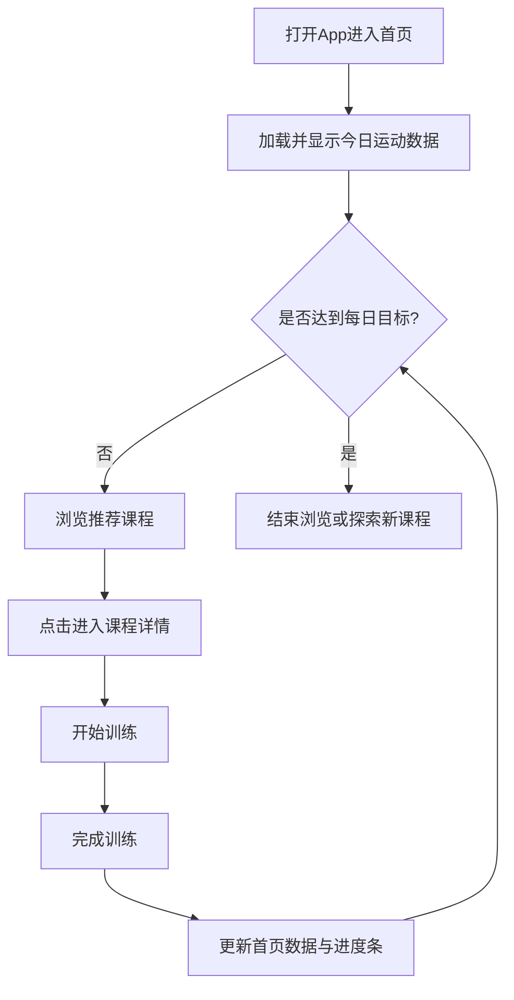

# 健身 App 首页 - 产品需求文档 (PRD)

> **使用说明**：本文档为健身 App 首页的详细产品需求文档，面向产品、设计、研发、测试，描述需求、页面结构、交互流程、业务规则与边界条件。

---

## 1. 📄 文档概述

| 字段 | 内容 |
|-----|------|
| 文档名称 | 健身 App 首页需求文档 |
| 模块/范围 | 移动端应用首页（运动数据、目标管理、课程推荐） |
| 作者 | 产品团队 |
| 创建时间 | 2026-03-24 |
| 当前版本 | v1.0 |
| 相关文档 | 《2024 年健身 App 用户行为研究》、Material Design 规范、iOS HIG |

### 1.1 修订历史

| 版本 | 日期 | 作者 | 变更说明 |
|-----|------|-----|---------|
| v1.0 | 2026-03-24 | 产品团队 | 初始版本，包含首页核心功能 |

### 1.2 文档说明

本文档详细描述健身 App 首页的功能需求与设计规范，为开发和测试提供依据。

---

## 2. 🎯 产品目标与背景

### 2.1 产品定位与目标用户

- **产品定位**：一款面向健身爱好者的移动端应用首页，旨在为用户提供直观的运动数据展示、目标管理和课程推荐功能。
- **目标用户**：18-45 岁的健身爱好者。特征：关注健康和体型、习惯移动设备记录、喜欢视觉化数据、需要专业指导。
- **核心场景**：日常健身打卡、查看运动数据、选择训练课程。

### 2.2 背景说明

随着人们对健康生活方式的追求，健身应用市场持续增长。用户需要一个能直观反馈运动成果、激励坚持并提供个性化指导的平台。通过现代化的暗黑主题设计和流畅交互体验，本应用旨在打造沉浸式运动体验，增强用户粘性。

---

## 3. 👤 用户与使用场景

### 3.1 用户角色

| 角色 | 定义/描述 | 典型系统能力范围 |
|-----|---------|--------------|
| 健身爱好者 | 注册并使用 App 进行日常锻炼的用户 | 查看数据、设定目标、浏览和启动课程 |

### 3.2 使用场景

**场景1：晨间查看运动数据**
- **用户**：健身爱好者小李
- **场景**：早上起床后打开应用
- **行为**：首页显示昨日运动数据（消耗 450 kcal，运动 60 分钟，连续 5 天）。查看今日目标进度为 0%。
- **结果**：连续天数带来成就感，决定开始今天的训练。

**场景2：选择训练课程**
- **用户**：健身新手小王
- **场景**：想开始训练但不知道做什么
- **行为**：在首页横向滑动“为你推荐”课程列表（如：HIIT 燃脂、腹肌训练等）。点击时长 20 分钟、难度 K3 的课程。
- **结果**：轻松发现并进入适合的课程详情页。

**场景3：完成每日目标**
- **用户**：上班族小张
- **场景**：下班后查看进度
- **行为**：看到环形进度条显示 85% (425/500 kcal)。点击“开始训练”选择 10 分钟快速训练。完成后进度更新为 100%。
- **结果**：清晰了解差距并快速完成目标。

---

## 4. 📋 功能清单（核心）

### 4.1 功能总览

| 编号 | 功能名称 | 所属模块 | 描述 | 优先级 | 备注 |
|-----|---------|---------|-----|-------|-----|
| F001 | 运动数据统计 | 首页 | 展示卡路里、时长、连续天数 | P0 | 核心功能，最关注信息 |
| F002 | 每日目标管理 | 首页 | 环形进度条展示卡路里目标完成度 | P0 | 核心功能，激励关键 |
| F003 | 底部导航 | 首页 | 底部全局导航，支持模块切换 | P0 | 基础交互 |
| F004 | 课程推荐 | 首页 | 根据偏好推荐个性化训练课程 | P1 | 提高转化率 |
| F005 | 浮动按钮 | 首页 | 提供快捷操作入口 | P2 | 辅助功能 |

### 4.2 业务规则（全局）

**规则 1：数据统计规则**
- 卡路里消耗：累计当日所有训练的卡路里消耗。
- 运动时长：累计当日所有训练的有效运动时间。
- 连续天数：从最近一次运动日开始，连续运动的天数（中断则重置为 0）。

**规则 2：目标进度计算**
- 进度百分比 = (已完成卡路里 / 目标卡路里) × 100%。
- 进度超过 100% 时，显示为 100%。
- 目标值可由用户自定义，默认为 500 kcal。

**规则 3：课程推荐规则**
- 根据用户历史训练数据推荐相似课程，优先推荐未完成课程。
- 课程列表至少展示 3 个课程，按推荐优先级排序。

---

## 5. 🔄 功能流程图

### 5.1 业务流程图

---

## 6. 🧩 页面说明与交互细节

### 6.1 全局交互规范

- **视觉风格**：暗黑模式，背景色 `#121212`，强调色霓虹绿 `#a6ff00`，文字白色 `#ffffff` 和灰色 `#888888`。16px 圆角，8px 栅格系统。
- **状态反馈**：所有可点击元素提供视觉反馈（缩放、颜色变化）。
- **加载状态**：数据加载时显示骨架屏或加载动画。网络异常显示友好提示。

### 6.2 【首页模块】

#### 6.2.1 【页面：App 首页】

**页面描述**：展示个人核心运动数据、今日卡路里目标进度，并提供横向滚动的推荐课程列表。

**功能 1：运动数据统计**
- **需求描述**：一目了然展示今日运动数据。
- **功能要求**：显示三个独立卡片（卡路里 kcal、分钟数、连续天数），配图标，数据实时更新。

**功能 2：每日目标管理**
- **需求描述**：环形进度条直观查看进度。
- **功能要求**：显示百分比及具体数值（如 328/500 kcal），中心或下方提供“开始训练”按钮。支持用户自定义目标。

**功能 3：课程推荐**
- **需求描述**：横向滚动展示课程列表。
- **功能要求**：卡片包含封面、标题、时长、难度(K1-K3)、标签。隐藏原生滚动条。动态加载数据。

**功能 4：底部导航**
- **需求描述**：包含首页、计划、统计、我的 4 个导航项。
- **功能要求**：固定在页面底部，高度 64px。选中项高亮，点击切换。

---

## 7. 📊 数据需求

### 7.1 数据字典

| 数据类别 | 字段说明 |
|---------|---------|
| 输入：用户信息 | 用户名、头像 URL |
| 输入：运动数据 | 今日卡路里消耗、运动时长、连续天数 |
| 输入：目标数据 | 每日目标值、当前完成进度 |
| 输入：课程数据 | 课程列表（ID、标题、时长、难度、分类、封面图） |
| 输出：事件数据 | 点击课程、开始训练、切换导航等行为埋点 |

---

## 8. 🎨 非功能性需求

### 8.1 性能与可用性
- **页面首次加载时间**：< 2 秒。
- **动画要求**：页面切换和横向滚动流畅无卡顿。
- **可用性**：关键操作触摸区域 ≥ 44×44 pt。色彩对比度符合 WCAG AA 标准。

### 8.2 兼容性
- 支持 iOS 12+ 和 Android 8+。
- 适配 375px - 428px 屏幕宽度。

---

## 9. 📦 风险与限制

- **技术风险**：数据同步延迟导致进度显示不准确；图片加载失败影响展示；低端设备动画可能卡顿。
- **业务风险**：推荐算法不准确影响体验；目标设定不合理影响积极性。
- **限制条件**：本版本仅限移动端；课程数据依赖在线接口，离线功能受限。

---

## 10. 🚀 后续规划

- **短期 (1-3 个月)**：增加数据趋势图表，支持自定义目标类型。
- **中期 (3-6 个月)**：增加社交功能（排行榜），支持计划管理。
- **长期 (6-12 个月)**：接入智能穿戴设备，提供 AI 私教。

---

## 11. 📎 附录

**术语表：**
- **kcal**：千卡，卡路里消耗单位。
- **HIIT**：高强度间歇训练。
- **K1/K2/K3**：难度等级，K1 入门，K3 高级。

**参考资料：**
- 竞品分析：Keep, Nike Training Club, Fitbit。
